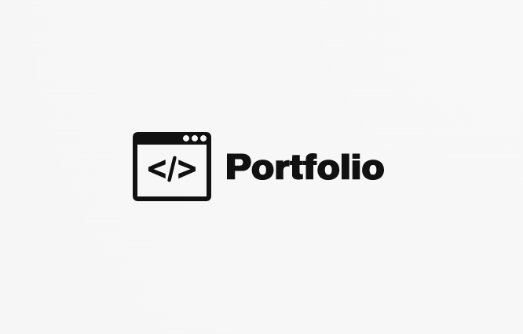
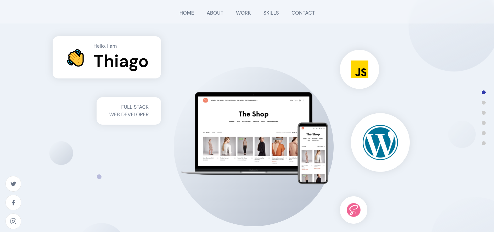

  

  <!--- These are examples. See https://shields.io for others or to customize this set of shields. You might want to include dependencies, project status and licence   info here --->
  <!---  https://youtu.be/Dl-ekLb4quE  --->
  
  

# MyPortfolio
> My professional Web Dev skills & experiences in a nutshell.

A brief description of your project, what it is used for and how does life get awesome when someone starts to use it.

 

## Screenshots
<h1 align="center">
    
</h1>

 

## Live Demo
You can see the live demo of [MyPortfolio](https://www.thiagodemenezes.com/)

 

## 🧪 Tech & Methodologies Applied

This project was developed with the following:

- [React](https://reactjs.org)
- [Firebase](https://firebase.google.com/)
- [TypeScript](https://www.typescriptlang.org/)

 
